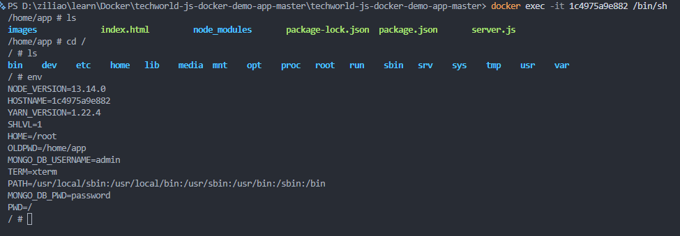

### Docker
- docker and virtual machine
- docker architecture
  - docker client(cli)
  - docker host(vm,physical server)
  - docker daemon
  - image(template used to build containers)
  - container (instance of image)
  - registries(store docker images;docker hub)
  - container: a running env for image
- Namespaces and Cgroups
  - Namespace: isolates resources(hard drive, networking, hostnames, users etc) for a particular process on a machine
  - Control group: limit, prioritize, and isolate resource usage(CPU, Disk, memory, I/O and network bandwidth) of a group of processes
- docker command
  - docker pull img:ver(pull image)
  - docker run [-d][-p 6000:6379][-e envVariable=value][--name renameContainer][--net networkName] img(pull images and start a container to run image;-d:detached mode; -p:port binding, 6000 host port, 6379 container application port)
  - docker run imgName:Tag(if not specifying tag, it's `latest` by default)
  - docker images(list local images)
  - docker start containerId(start container)
  - docker stop containerId(stop container)
  - docker ps(list running containers)
  - docker exec -t my-container ls(-t: allocate a terminal to run interactive commands like bash within the container)
  - docker logs (log all)
  - docker ps -a(lists running and stopped containers)
  - docker logs containerId/containerName [-f](debug in a specific container; -f: keep logging)
  - docker exec -it containerId/containerName /bin/sh(or /bin/bash; create a terminal for a container to run linux command)
    - 
  - docker network create mongo_network(create shared network among multi images)
  - docker rm containerName(remove container)
  - docker rmi imageName(remove image)
  - docker run -v /host/path/directory:/container/directory/path(create volumes)
  
- docker compose(takes care of creating a common network for multi images; should start after changing compose file)
  - command: docker-compose -f mongo.yaml up[down] -d
  ```
    version:'4.0'
    services:
      mongodb:(container name)
        image:mongo
        ports:
          -27017:27017(hostPort:containerPort)
        volumes:
          <!-- - host-volume-name: path-inside-of-the-container -->
          - mongo-data: /data/db
        environment:
          -envVariable=value
      mongo-express:
        image:mongo-express
    volumes:
      mongo-data:
        driver:local
  ```
- Dockerfile- a blueprint for building images
  - command: docker build -t myApp:1.0 . (imageName:tag; using Dockerfile from current folder . to build)
  ```
  <!-- start by basing our built image on another image -->
  FROM node:13-alpine

  <!--optionally define env variables  -->
  ENV MONGO_DB_USERNAME=admin \
      MONGO_DB_PWD=password
<!-- execute any linux command, create folder -->
  RUN mkdir -p /home/app
<!-- copy current folder to -->
  COPY ./app /home/app

   <!-- set default dir so that next commands executes in /home/app dir -->
  WORKDIR /home/app

   <!-- will execute npm install in /home/app because of WORKDIR -->
  RUN npm install

   <!--start the app from entry point: server.js; no need for /home/app/server.js because of WORKDIR -->
  CMD ["node", "server.js"]

  ```
- docker repository(one image one repo)
  - pushing our built Docker image to a private registry on AWS
    - AWS ECR
      - install AWS CLI 
      - authenticate docker client to AWS registry
      - 
- create ubuntu vm(EC2) on AWS to install docker
- deploy Docker image to server
- Docker Volume- data persistence 
  - 3 types of volumes
    - **Named Volume**
    - anonymous Volume
    - host volume
  - different db path
    - mysql:var/lib/mysql
    - postgres: var/lib/postgresql/data
    - mongodb: /data/db  
